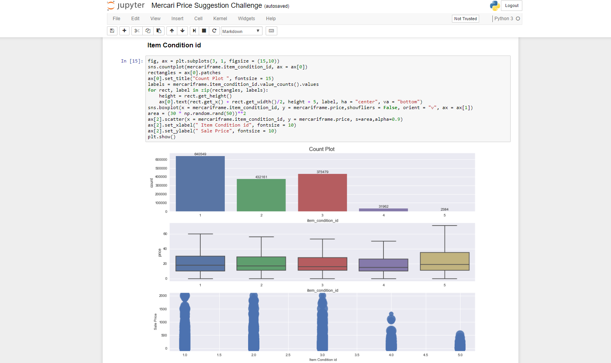
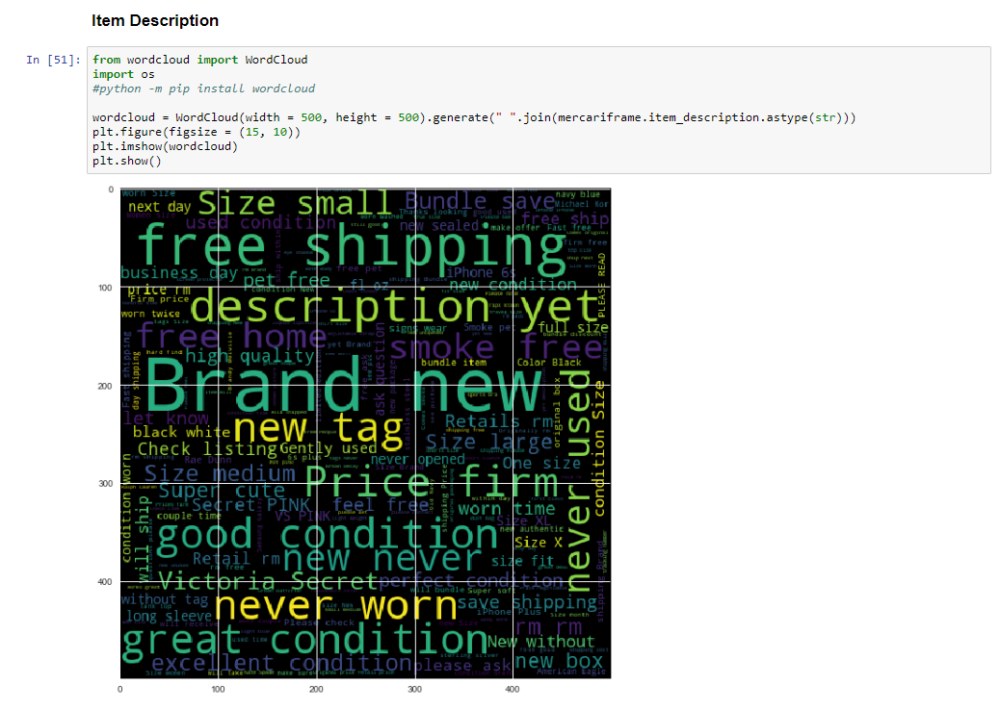

# Mercari Price Suggestion Challenge
<p>In this project, we tried to provide the best algorithm that automatically suggests the right product prices for shopping app from product name, user-inputted text descriptions of the product, category name, brand name, item condition, and shipping information </p>

Cheat sheet for reference :  https://github.com/girishkathireddy/Python/wiki

Data Source Link: <a href="https://www.kaggle.com/c/mercari-price-suggestion-challenge/data"> Data</a>

## Technologies
```
Python
```

## Tools 
```
Jupyter Notebook using Anaconda
```
## Project Outline

- Raw Data Collection
- Data Preprocessing
- Data Cleaning
- Exploratory Data Analysis
- Data Modelling
   * Linear Regression
   * Naive Bayes Classifier
   * K - Nearest Neighbours 
   * K - Means
   * Random Forest Regression  

## Image 


## Image 

